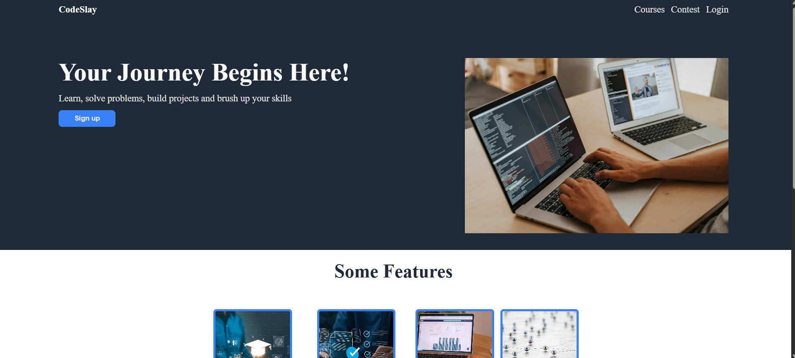
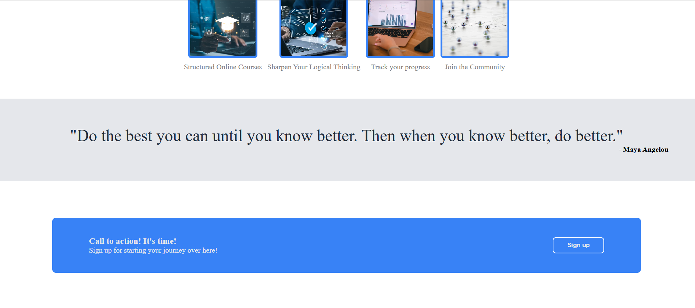

# CodeSlay - Landing Page

A modern landing page built as part of **The Odin Project** Foundations curriculum. This project focuses on building a complete webpage from a given design using HTML and CSS, with an emphasis on Flexbox for layout.

## Live View
https://simran-1316.github.io/odin-landing-page

## 📸 Preview




## ✨ Features

- Responsive Flexbox-based layout (desktop)
- Modern hero section
- Feature cards with images
- Motivational quote section
- Call-to-action (CTA) section
- Clean footer
- Custom branding with **CodeSlay**

## 🛠️ Built With

- HTML5
- CSS3
- Flexbox

## 📚 What I Learned

This project helped me strengthen my understanding of:

- Structuring HTML semantically
- Building layouts using Flexbox
- Parent-child relationships in CSS
- Spacing using margin, padding, and gap
- Image sizing with `object-fit`
- Creating reusable UI sections
- Styling buttons, cards, and typography

## 📂 Project Structure

```
landing-page/
│── index.html
│── style.css
│── README.md
```

## 📖 Credits

This project was inspired by the **Landing Page** project from **The Odin Project**.

### Images

- Hero image: Pexels
- Feature images: Unsplash, Pexels, and iStock (used for educational purposes)

## 👨‍💻 Author

**Simran Rawat**

GitHub: https://github.com/simran-1316

---

Made with ❤️ while learning Full Stack Development through The Odin Project.